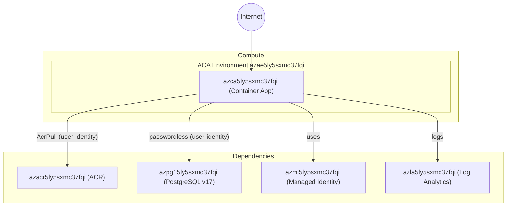

# Deployment Summary — PhotoAlbum to Azure Container Apps

## Status: ✅ Success

## Application

| Property | Value |
|----------|-------|
| Name | Photo Album |
| Stack | Java 25 / Spring Boot 4.1.0 / Thymeleaf |
| Hosting | Azure Container Apps |
| Image | `azacr5ly5sxmc37fqi.azurecr.io/photo-album:latest` |
| URL | https://azca5ly5sxmc37fqi.nicecoast-c5a6b225.eastus2.azurecontainerapps.io |

## Azure Resources Provisioned

| Resource Type | Name | Region | Notes |
|---------------|------|--------|-------|
| User-Assigned Managed Identity | `azmi5ly5sxmc37fqi` | eastus2 | Passwordless PostgreSQL auth + ACR pull |
| Log Analytics Workspace | `azla5ly5sxmc37fqi` | eastus2 | Container app logs |
| Azure Container Registry | `azacr5ly5sxmc37fqi` | eastus2 | Hosts `photo-album:latest` |
| Container Apps Environment | `azae5ly5sxmc37fqi` | eastus2 | ACA runtime environment |
| Azure Database for PostgreSQL v17 | `azpg15ly5sxmc37fqi` | westus3 | Burstable B1ms, passwordless Entra auth |
| Azure Container App | `azca5ly5sxmc37fqi` | eastus2 | 1-3 replicas, port 8080, public ingress |
| Service Connector (ServiceLinker) | `photoalbum_pg_connection` | — | Maps container app → PostgreSQL with UAMI |

## Architecture Diagram

## Files Created/Modified

| File | Description |
|------|-------------|
| `Dockerfile` | Updated base images to `maven:3.9-eclipse-temurin-25-alpine` + `eclipse-temurin:25-jre-alpine` |
| `src/main/resources/application.properties` | Externalized `server.port` → `${SERVER_PORT:8080}` |
| `src/main/resources/application-docker.properties` | Externalized `server.port` → `${SERVER_PORT:8080}` |
| `infra/modules/containerapp.bicep` | Added `SERVER_PORT=8080` env var to container app template |
| `infra/deploy.ps1` | Fixed service connector connection name (hyphen → underscore) |
| `infra/infra-config.md` | Generated with all provisioned resource details |

## Deployment Notes

- **Managed Identity**: User-assigned identity `azmi5ly5sxmc37fqi` has AcrPull role on ACR and is an Entra admin on PostgreSQL
- **Service Connector**: `photoalbum_pg_connection` injected Spring datasource env vars into the container app
- **Port externalization**: `SERVER_PORT=8080` env var added to the container app configuration, resolving the hardcoded port assessment finding
- **Passwordless auth**: Zero stored secrets — all PostgreSQL access via short-lived Entra tokens
- **Build**: ACR remote build (Run ID: ch2), 1m9s — image digest `sha256:fe209654...`
