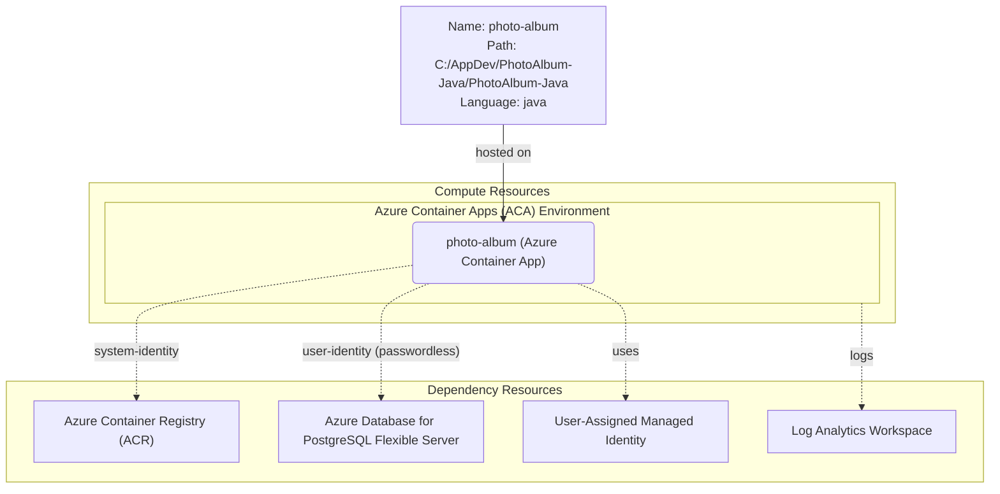

# Azure Deployment Plan for PhotoAlbum Project

## **Goal**
Deploy the Photo Album Java Spring Boot application to Azure Container Apps with a new Azure Container Apps environment and Azure Database for PostgreSQL Flexible Server, using Bicep IaC and Azure CLI. Externalize `server.port` as the `SERVER_PORT` environment variable to resolve the hardcoded port assessment finding.

## **Project Information**

**PhotoAlbum**
- **Stack**: Java 25 / Spring Boot 4.1.0
- **Type**: Photo storage and gallery web application with Thymeleaf UI
- **Containerization**: Dockerfile present at `./Dockerfile` (multi-stage Maven + OpenJDK 25)
- **Dependencies**: Azure PostgreSQL Flexible Server (passwordless via Managed Identity), Spring Cloud Azure 7.3.0
- **Hosting**: Azure Container Apps

## **Azure Resources Architecture**

> **Install the mermaid extension in IDE to view the architecture.**

## **Existing Azure Resources**

| Resource Type | Name | Purpose |
|---------------|------|---------|
| — | — | No existing resources — new provisioning required |

**Missing resources (to be provisioned):**
- User-Assigned Managed Identity
- Log Analytics Workspace
- Azure Container Registry (Basic SKU)
- Container Apps Environment
- Azure Database for PostgreSQL Flexible Server (v17, Burstable B1ms)
- Azure Container App

## **Execution Steps**

> **Below are the steps for Copilot to follow; ask Copilot to update or execute this plan.**

**CRITICAL: Do NOT run `az login` until 'Env setup' step.**

1. **Containerization**
   - [x] Dockerfile exists at `./Dockerfile` (multi-stage Maven 3.9.9 + eclipse-temurin:25-jre)
   - Output: `./Dockerfile`

2. **Source code fix: Externalize server.port**
   - [ ] Update `application.properties` line 2: `server.port=${SERVER_PORT:8080}`
   - [ ] Update `application-docker.properties` line 40: `server.port=${SERVER_PORT:8080}`
   - [ ] Update `containerapp.bicep` to inject `SERVER_PORT` env var

3. **Env setup for AzCLI**
   - [ ] Verify AZ CLI installed
   - [ ] Run `az login` and select subscription
   - [ ] Install `serviceconnector-passwordless` extension
   - [ ] Set default subscription

4. **Provisioning**
   - [ ] Use `infrastructure-bicep-generation` skill or existing Bicep in `./infra/`
   - [ ] Provision: RG, Identity, Log Analytics, ACR, Container Apps Env, PostgreSQL, Container App
   - [ ] Run `infra/deploy.ps1`

5. **Check Azure resources existence**
   - [ ] Container App: `az containerapp show -o json`
   - [ ] PostgreSQL: exists and firewall allows Azure Services
   - [ ] ACR: login server available
   - [ ] Service Connector: passwordless connection verified

6. **Build & Deploy Application Image**
   - [ ] `az acr build` to build and push image to ACR
   - [ ] Update Container App image reference
   - [ ] Verify container app is running

7. **Deployment Validation**
   - [ ] Call `appmod-get-app-logs` to verify application startup
   - [ ] Confirm app is accessible via FQDN

8. **Summarize Result**
   - [ ] Call `appmod-summarize-result`
   - [ ] Write `deployment-summary.md`

## **Progress Tracking**
See `progress.md`

## **Tools Checklist**
- [ ] appmod-analyze-repository
- [ ] appmod-plan-generate-dockerfile
- [ ] appmod-build-docker-image
- [x] appmod-summarize-result (pending execution)
- [ ] appmod-get-app-logs
